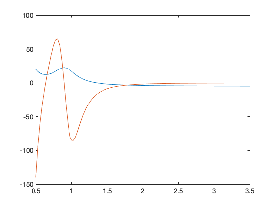
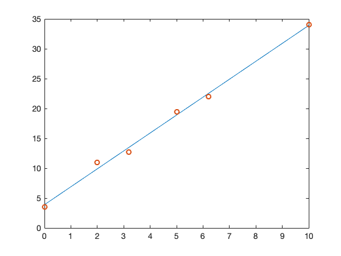

# 4 Convergence of Simpson’s rule

```matlab
err = zeros(7,1);
h4 = zeros(7,1);
h = zeros(7,1);
ratio = zeros(7,1);
for i = 1:7
    n = 2^i
    err(i) = abs(compsimps(0,pi/2,n) - 1);
    h4(i) = (pi/(2*n))^4;
    h(i) = (pi/(2*n));
    ratio(i) = err(i)/h4(i);
end
ratio
loglog(h,err)
grid on;
xlabel('h')
ylabel('Absolute Error')


function ans = compsimps(a, b, n)
    h = (b-a)/n
    sum_even = 0;
    for i = 1:n/2-1
        x(i) = a + 2*i*h;
        sum_even = sum_even + f(x(i));
    end
    sum_odd = 0;
    for i = 1:n/2
       x(i) = a + (2*i-1)*h;
       sum_odd = sum_odd + f(x(i));
    end
    ans = h*(f(a)+ 2*sum_even + 4*sum_odd +f(b))/3;
end

function y = f(x)
    y = cos(x);
end
```

```matlab
ratio =

    0.0060
    0.0057
    0.0056
    0.0056
    0.0056
    0.0056
    0.0056

```


# 6 Newton minimization


```matlab
syms x;
f(x) = 1/((x-0.3)^2 + 0.01) + 1/((x-0.9)^2 + 0.04) - 5
fp(x) = diff(f);
fpp(x) = diff(fp);
```


    f(x) =
     
    1/((x - 9/10)^2 + 1/25) + 1/((x - 3/10)^2 + 1/100) - 5


```matlab
x = linspace (0.5,3.5);
plot(x,f(x)) 
hold on;
plot(x,fp(x))
```





Blue: $f(x)$

Orange: $f'(x)$


```matlab
epsilon = 1e-6; 
q = 0;
p = 0.5;
while (abs(p-q)>epsilon)
    q = p;
    p = vpa(p - fp(p)/fpp(p),50);
end
vpa(p,5)
```


    ans =
     
    0.63701


# 7 Summer correlation


```matlab
x = [0 2 3.2 5 6.2 10];
y = [3.5 11 12.7 19.4 22 34];
```


```matlab
p = polyfit(x,y,1)
```


    p =
    
        3.0007    3.8971


​    
    f =
    
        3.8971    9.8984   13.4992   18.9004   22.5012   33.9036


```matlab
xx = linspace (0,10);
f = polyval(p,xx);
plot(xx,f)
hold on;
scatter(x,y);
```





The blue line is the best linear fit:
$$
Y = 3.0007X + 3.8971
$$

Correlation Analysis:


```matlab
corrcoef(x,y)
```


    ans =
    
        1.0000    0.9977
        0.9977    1.0000


The correlation coefficient = 0.9977.
